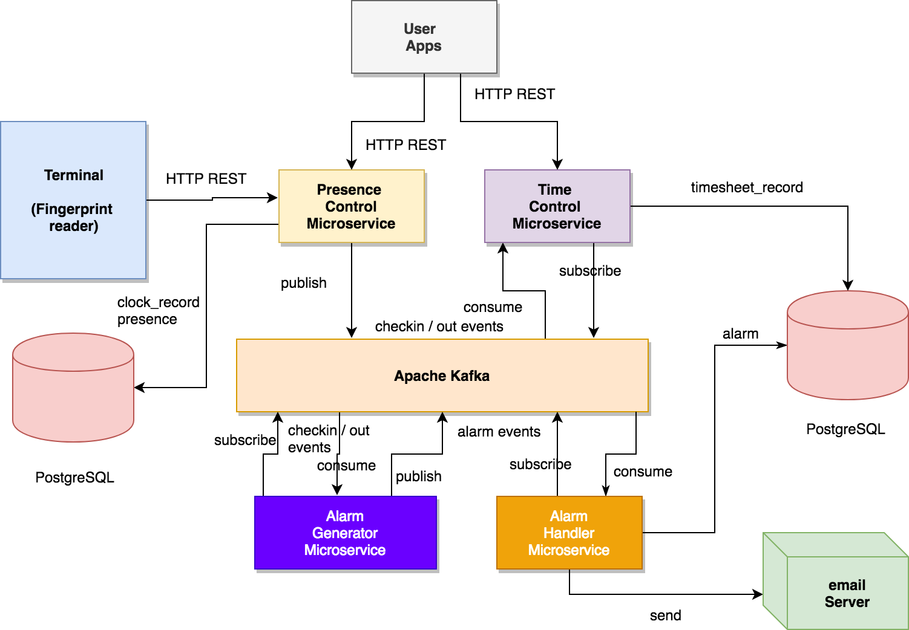
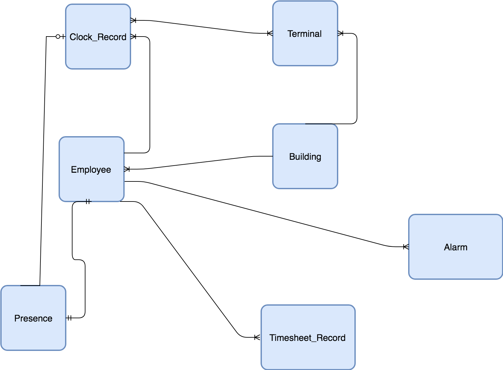

# microservice Challenge : Employee Presence Control System

## Architecture



The figure above shows the proposed system architecture. Such architecture is based on microservices that expose REST interfaces
and which interact among them through events delivered by a Kafka Broker. Thus it follows, the event-driven microservice architectural pattern. 

The main sofware components are:

* **User Application(s)**. They implement the application user interfaces. They obtain data through HTTP REST (GET) interfaces, exposed by microservices, about employee's presence, check in/out history, employee's timesheet, alarms, etc.
Such data might be presented to the user in different formats. 

* **Fingerprint reader (Terminal)**. It reads an employee's fingerprint. Once a fingerprint is recognized it sends check in/out requests to the Presence Control Microservice.
The communication between the terminal and the referred microservice is done through HTTP REST (POST).

* **Presence Control Microservice**. Exports an HTTP REST interface (GET, POST) that offers operations concerning check in, check out, retrieving the employee's check in/out history and retrieving the presence status.
The OpenAPI specification (Swagger) can be found [here](https://app.swaggerhub.com/apis-docs/jmcanterafonseca/Clock_Service/0.1). In addition, it plays the role of Kafka Publisher of "check in/out" events.  

* **Time Control Microservice**. It plays the role of a Kafka Consumer of "check out" events.
Every time there is an employee check out, this microservice calculates the time elapsed since the previous check in, and updates the timesheet record (by incrementing the number of worked hours) corresponding to the concerned date.
It also offers an HTTP REST interface, which OpenAPI specification can be found [here](https://app.swaggerhub.com/apis-docs/jmcanterafonseca/TimeService/0.1).
Such API allows applications to obtain (HTTP GET) the timesheet records of an employee (records which include the effective worked hours per day). 
In the future this service may also perform aggregations by month, year, etc. For further study. 

* **Alarm Generator Microservice**. It is in charge of generating alarms so that HR responsible persons can receive asynchronous notifications about abnormal situations. 
It plays the role of a Kafka Consumer of "check in / out" events. It publishes new alarms to Kafka, so that those alarms can be properly handled. Currently the following alarms are generated:
    * Late check in. When an employee checks in late, after some threshold hour.
    * Late check out. When an employee checks out late, after some threshold hour.
    * Day Absence. When an employee has been absent during a whole day.
    * Temporal Absence. When an employee has been absent for a certain period of time (threshold) during the day.

* **Alarm Handler Microservice**. It plays the role of a Kafka Consumer of alarm events. Every time there is a new alarm this microservice handles it by sending an asynchronous notification (by email) to the configured users.
In the current implementation alarms are also persisted to a table in the database.

* **Kafka Broker**. It enables asynchronous, reliable, event-driven communication between microservices. 

* **PostgreSQL**. It plays the role of datastore.

In the future the Alarm generator microservice may also include batch processes to be executed periodically in order to check employee compliance with time and presence rules. For further study. 

## Data Model



The figure above shows the proposed relational data model. The three main entities/tables are:

* Clock_Record: It contains one record per employee and pair of check in / check out. It holds all the employee history concerning presence control. 
* Presence: It contains one row per employee with the current presence status. It allows direct access to status without going through the Clock_Record table. 
* Timesheet_Record: It contains one record per employee and per working day summarizing the number of hours worked by the referred employee. 

The rest of entities are primarily auxiliar and contain master data about employees, fingerprint terminals and buildings. Alarms (abnormal employee presence situations) have also
been modelled.

## Implementation

The system has been implemented in Scala. DB communication is done through JDBC. All the components have been Dockerized for easier deployment.
Two of the microservices (presence control and time control) include functional tests.
The REST framework used is [Scalatra](http://scalatra.org).
All the services are configurable through environment variables to allow easier dockerization. 

## How to run

### Configuration: Environment variables

All the microservices are configurable through the following environment variables (examples are shown):

```
- Db_Url=jdbc:postgresql://localhost:5432/presence_control
- Db_User=A
- Db_Pass=B
- Kafka_Broker=kafka:9092
```

Additionally the alarm handler microservice depends on the following environment variables:

```
- Email_Server=smtp.googlemail.com
- Email_Server_User=user@gmail.com
- Email_Server_Pass=pass
- Alarm_Recipient=jmcanterafonseca@gmail.com
```

### Manual run 

Preconditions:

* Java 8 JDK installed
* Scala tools installed: sbt, etc. 
* Run Apache Kafka on localhost port 9092
* Run Postgresql on localhost port 5432
* If these services are running on a different host or port you would need to configure the proper environment variables as described above.
* If you want to receive alarms by email you would need to change the `Alarm_Recipient` to your email address. 

```
git clone https://github.com/jmcanterafonseca/microservices-challenge
```

* Create a new DB User, suggested, microservice/microservice. 
* Create a new Database, suggested "presence_control", owned by the user created before. 
* Run the script `create_tables.sql`, using psql or pgAdmin. 
* Run the script `master_data.sql`, using psql or pgAdmin. 
* Run the following commands in different consoles:

```
cd presence_control_mservice
sbt run
```

```
cd time_control_mservice
sbt run
```

```
cd alarm_generator_mservice
sbt run
```

```
cd alarm_handler_mservice
sbt run
```

* Do a check in

```
curl -X POST \
  http://localhost:5000/clock/v1/check_in \
  -H 'Cache-Control: no-cache' \
  -H 'Content-Type: application/json' \
  -d '{
	"employeeId": 2,
	"terminalId": "A2378KJH"
}
```

* Do a check out (after some time)

```
curl -X POST \
  http://localhost:5000/clock/v1/check_out \
  -H 'Cache-Control: no-cache' \
  -H 'Content-Type: application/json' \
  -d '{
	"employeeId": 2,
	"terminalId": "A2378KJH"
}
```

* Query presence of an employee

```
curl -X GET \
  http://localhost:5000/clock/v1/presence/2 \
```

* Query timesheet of an employee

```
curl -X GET \
  'http://localhost:6000/timecontrol/v1/timesheet/2?start_date=2018-12-30&end_date=2019-01-08' \
```

etc. 

### Using Docker

T.B.D. (Task not completed). (There is an intentional `docker-compose.yml` **not tested!!**)

```
docker-compose up
```

* Creating the DB and loading master data as described in the manual running steps. 

Nonetheless, the individual Docker images corresponding to the different microservices developed can be easily generated by running

```
   sbt docker:publisLocal
```

## Running tests

Tests are only included by the presence control and time control microservices.
To run them just type in a console the following commands: 

```
cd presence_control_mservice
sbt test
```

```
cd time_control_mservice
sbt test
```

## Technical Debt

* A common library of reusable classes, avoiding code duplication through microservices.
* The Alarm Generator and Alarm Handler microservices do not include any tests.
* Proper stop mechanisms for the Kafka-based microservices.
* Endpoint ports of presence control and time control microservices configurable via environment variables.
* Alarm thresholds (for check in, check out, etc.) should be configurable through environment variables or similar.


## Future work

* Complete `docker-compose.yml` and test.
* Perform employee's effective work time aggregations by month, year, etc. 
* Implement a more sophisticated algorithm for generating alarms. For instance, by taking into account work shifts, vacations, etc. 
* Study the need of incorporating batch processes to be executed periodically in order to enforce time control rules.
For instance, a process run once a month to verify that employees are actually working the amount of hours required. 
