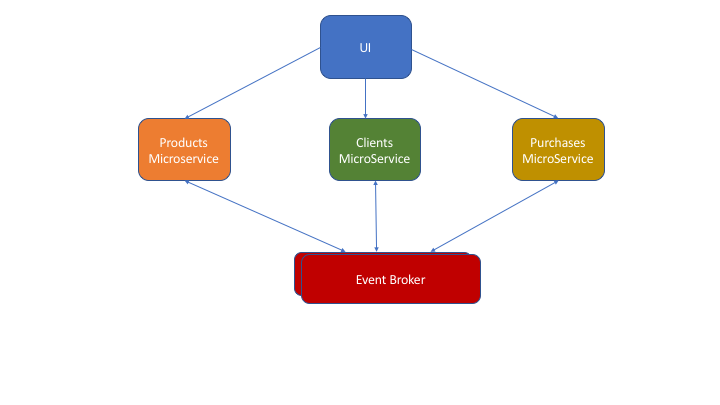
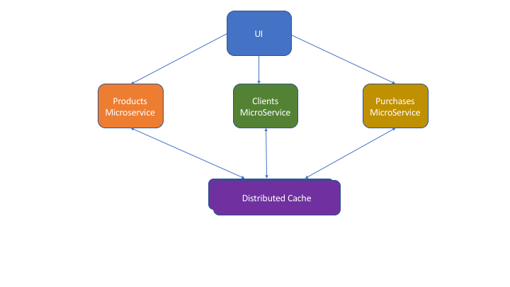

# Multidomain Architecture

## Problem Statement / Assumptions

The information to be maintained are *Customers*, *Products* and Purchases. A Product can be purchased by multiple Customers. 
A Customer can buy multiple Products. It is required to be able to manage customer purchases and we want to have a user
interface that allows to search for information about customers (and their products) or products (and the 
customers who have purchased any of them). 

### Solution 

See the figure below:

* How many microservices there should be? 

There should be **three** different microservices (one for each main business function): 

* A **Customer Microservice** which maintains data about the customers in a company. This Microservice offers a REST API
that allows to, at least, to retrieve customer data. We assume the microservice allows to obtain customers by id and by 
filtering conditions (name, age, etc.). If a Customer is added or removed. an event (with the customer id) is emitted to an event broker, so that it can be listened by other microservices. In addition, the Customer Microservice contains a mini-bridge table customerid-productid that captures whether a customer has bought a certain product. Such mini-bridge table is filled by listening to events emitted by the Purchases microservice.

* A **Catalog Microservice** which maintains all the data about the products that the company is offering to Customers. 
This Microservice offers a REST API that allows to, at least, to retrieve data about products. We assume this microservice allows to obtain products by id and by filtering conditions (product name, etc.). We can assume as well that this microservice maintains the stock quantities. If a new Product is added, removed or modified (for instance, stock changes) an event (including the product id) is emitted to an event broker, so that it can be listened by other microservices. Catalog microservice contains a mini-bridge table productid-customerid that captures whether a product has been bought by a customer. Such mini-bridge table is filled by listening to events emitted by the Purchases microservice.

* A **Purchases Microservice** which allows to purchase a Product by a Customer, a certain number of units. This microservice
will expose at least one operation `purchase(customer_id, product_id, quantity)`. It listens to events emitted by the rest of microservices so that it knows valid product ids, and valid customer ids, etc. An event is emitted when a new purchase is done, so that the rest of microservices can keep up to date their information about who has bought what. In addition, the Catalog Microservice could take the opportunity to update stocks automatically after a purchase. 

### Scenarios

**Scenario 1**: Search for all customers (or only those matching a filter) including information about the products they have bought. The *Controller front-end component* in charge of resolving this request will perform the following steps:

1. Interact with the Customer MicroService by querying data through the REST API including an empty filter. The Customer MicroService will execute a couple of queries that will allow to obtain the information of each matching customer as well as the list of product ids associated to each matching customer. 

2. Interact with the Product MicroService by asking for the information of the products purchased by each customer present in the current page (as the response from the Customer microservice only would contain product ids, but not descriptions or other information). 

**Scenario 2**: Search for all products including information about the customers that have purchased those products. The *Controller front-end component* in charge of resolving this request will perform the following steps:

1. Interact with the Product MicroService by querying data through the REST API including an empty filter. The Product MicroService will execute a couple of queries that will allow to obtain the information of each matching product as well as the list of customer ids associated to each product. The latter can be long and it may need pagination by itself as well. 

2. Interact with the Customer MicroService by asking for the information of the customer who purchased each product in the current page (as the response from the Product microservice would only contain ids, but not the names or other information about customers).

### Alternative Architecture using a distributed cache for bridges and master ids

Instead of having mini-bridge tables living in the domain of each microservice, those bridge tables could be stored in a distributed cache (e.g. Apache Ignite) that could be kept up to date by the different Microservices. That cache could contain the list of valid product ids, the list of valid customer ids, and an associative table or bridge table linking customers and products. See figure below. 

